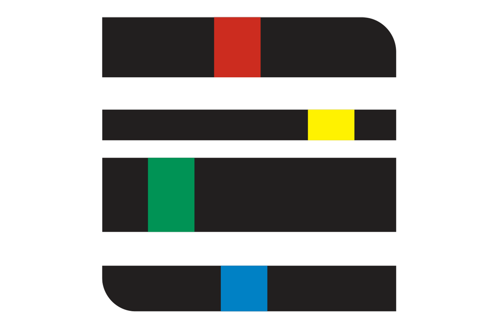
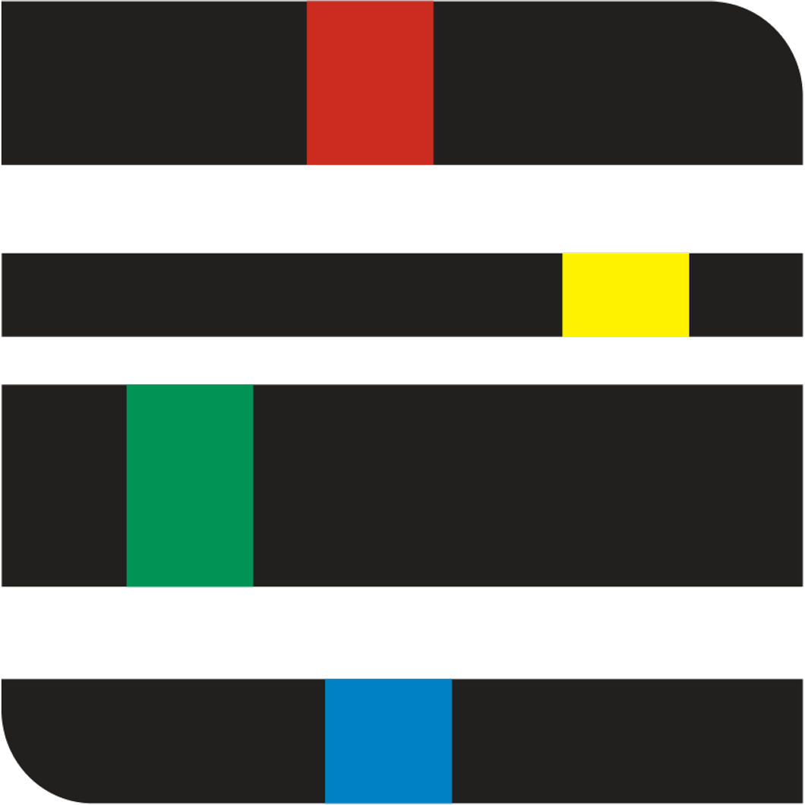

# Logos

<figure markdown="span">
  { width="300" }
  <figcaption>nexus_logo_schwarz_large</figcaption>
</figure>

<figure markdown="span">
  { width="300" }
  <figcaption>nexus_logo_schwarz_medium</figcaption>
</figure>

<figure markdown="span">
  { width="300" }
  <figcaption>nexus_logo_schwarz_small</figcaption>
</figure>

<figure markdown="span">
  { width="300" }
  <figcaption>nexus_logo_weiss_large</figcaption>
</figure>

<figure markdown="span">
  { width="300" }
  <figcaption>nexus_logo_weiss_medium</figcaption>
</figure>

<figure markdown="span">
  { width="300" }
  <figcaption>nexus_logo_weiss_small</figcaption>
</figure>

<figure markdown="span">
  { width="300" }
  <figcaption>nexus_schwarz_logo_only_600x400_padding</figcaption>
</figure>

<figure markdown="span">
  { width="300" }
  <figcaption>nexus_schwarz_logo_only_padding</figcaption>
</figure>

<figure markdown="span">
  { width="300" }
  <figcaption>nexus_schwarz_logo_only_transparent</figcaption>
</figure>

<figure markdown="span">
  { width="300" }
  <figcaption>nexus_schwarz_logo_only</figcaption>
</figure>

<figure markdown="span">
  { width="300" }
  <figcaption>nexus_slack_logo</figcaption>
</figure>
