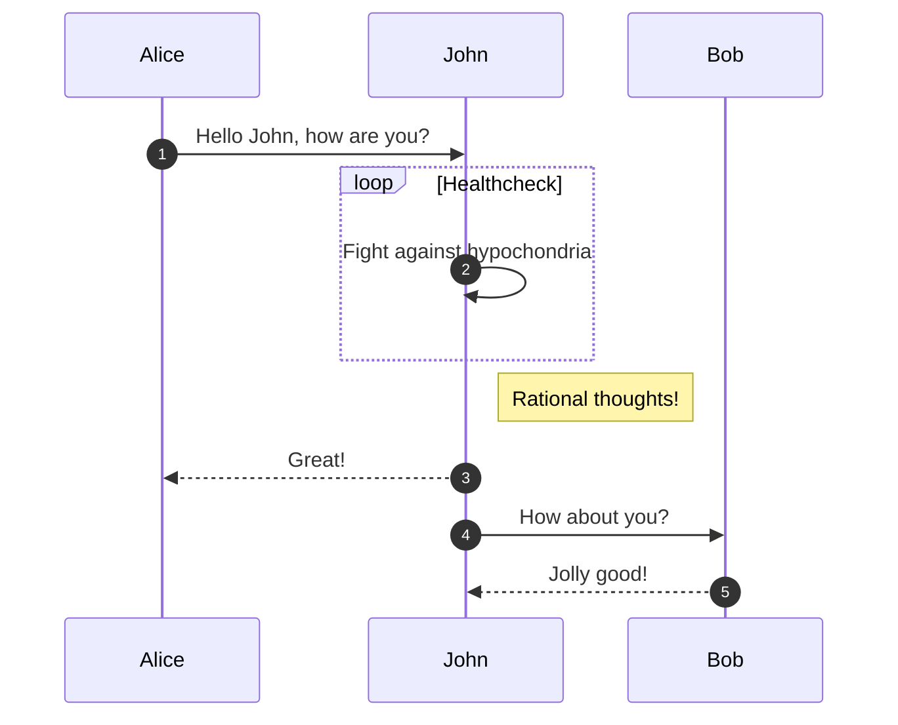
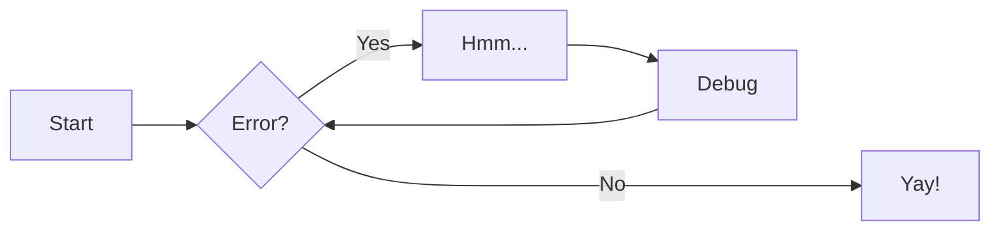

# Introduction to MkDocs Markdown
### Visual Formatting
This final section introduces how to draw diagrams and show pictures in our Markdown files.

#### Diagrams
These are only some of the example diagrams that you can create using the mermaid extension.



```markdown linenums="1"
  ``` mermaid
  sequenceDiagram
    autonumber
    Alice->>John: Hello John, how are you?
    loop Healthcheck
        John->>John: Fight against hypochondria
    end
    Note right of John: Rational thoughts!
    John-->>Alice: Great!
    John->>Bob: How about you?
    Bob-->>John: Jolly good!
  ```
```

#### FlowCharts




```markdown linenums="1"

  ``` mermaid
  graph LR
    A[Start] --> B{Error?};
    B -->|Yes| C[Hmm...];
    C --> D[Debug];
    D --> B;
    B ---->|No| E[Yay!];
  ```

```


#### Figures


```markdown linenums="1"


```

#### Figures With Captions

<figure markdown="span">
  { width="300" }
  <figcaption>Image caption</figcaption>
</figure>

```markdown linenums="1"
<figure markdown="span">
  { width="300" }
  <figcaption>Image caption</figcaption>
</figure>
```

#### Local Figures

<figure markdown="span">
  { width="300" }
  <figcaption>Local image</figcaption>
</figure>

```markdown linenums="1"
<figure markdown="span">
  { width="300" }
  <figcaption>Local image</figcaption>
</figure>
```